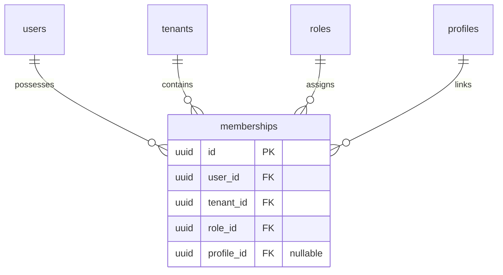

# 🗃️ Modelo de Dados e Esquema de Banco (TypeORM) - Backend

Este documento mapeia e explica as principais entidades do TypeORM e suas relações no banco de dados PostgreSQL do **SmartContact**.

---

## 👥 1. Identidade e Acesso (`User` e `Membership`)

O sistema adota o paradigma multi-tenant N:N. Os usuários possuem um login único global, mas suas permissões, dados de equipes e perfis são escopados localmente por Tenant através da entidade pivot `Membership`.

### Entidade `User`
Representa o cadastro de identidade global único pelo e-mail.
* **Arquivo:** [user.entity.ts](file:///home/jaspion/projetos/smartcontact/backend/src/users/entities/user.entity.ts)
* **Atributos Principais:**
  * `id`: UUID (Primary Key)
  * `email`: String (Unique) - E-mail de login global
  * `cpf`: String (Unique, Nullable) - Cadastro de pessoa física
  * `password`: Hash da senha de acesso
  * `isSuperAdmin`: Boolean - Bypass administrativo para todo o ecossistema SaaS
  * `isActive`, `isVerified`: Booleans de controle de cadastro
  * **Relacionamentos:** `OneToMany` com `Membership`, `Tag`, `Phone`, `Address`, `UserEmail`, `UserLink`.

### Entidade Pivot `Membership`
Coração do multi-tenancy. Associa o usuário ao escopo do Workspace.
* **Arquivo:** [membership.entity.ts](file:///home/jaspion/projetos/smartcontact/backend/src/memberships/entities/membership.entity.ts)
* **Atributos Principais:**
  * `userId`: UUID (FK)
  * `tenantId`: UUID (FK)
  * `roleId`: UUID (FK) - Função local no workspace
  * `profileId`: UUID (FK, Nullable) - Vincula os dados de vendedor/membro de time. Se for `null`, o usuário é classificado como "Usuário Standard" (acesso apenas a seus próprios recursos).
  * **Índice Único:** `['userId', 'tenantId']` (Um usuário só pode ter uma única membership ativa por workspace).

---

## 🏷️ 2. Redirecionamento Dinâmico e Hardware (`Tag`)

Representa o chip físico NFC ou código QR delegado a um funcionário. As Tags contêm as chaves lógicas de redirecionamento dinâmico.

* **Arquivo:** [tag.entity.ts](file:///home/jaspion/projetos/smartcontact/backend/src/tags/entities/tag.entity.ts)
* **Atributos Principais:**
  * `id`: UUID (Primary Key)
  * `uuid`: UUID (Unique, Index) - Código de roteamento público no resolvedor (`/t/:uuid`)
  * `uid`: String (Unique no escopo do Tenant, Nullable) - ID físico do chip NFC (ex gravado na Tag)
  * `handle`: String (Unique, Length 120) - Link curto personalizado do perfil (ex: `/t/joao`)
  * `isResource`: Boolean - Sinaliza se a tag é um recurso delegado do estoque
  * `nfcRedirectMode` / `qrRedirectMode`: Enum (`RedirectMode`)
  * `nfcCustomUrl` / `qrCustomUrl`: String (URL externa opcional)
  * `userId` & `tenantId`: FKs de amarração de posse e isolamento
  * `ownerId`: UUID - Usuário dono do recurso (para travas ABAC)

### Enums Auxiliares (`RedirectMode`, `TechnologyType`)
* `RedirectMode`: `PROFILE` (página pública), `WHATSAPP` (abertura rápida), `VCARD` (download direto), `CUSTOM_URL` (redirecionamento externo).
* `TechnologyType`: `NFC_HF` (High Frequency NFC), `RFID_UHF`, `QR_CODE`, `LINK` (link puro), `TRILHA`.

---

## 📈 3. Rastreamento e Captação de Leads (`InteractionLog`)

Grava todas as leituras físicas ocorridas nas tags, servindo de motor de analytics e de captura de novos contatos/leads.

* **Arquivo:** [interaction-log.entity.ts](file:///home/jaspion/projetos/smartcontact/backend/src/interaction-logs/entities/interaction-log.entity.ts)
* **Atributos Principais:**
  * `id`: UUID (Primary Key)
  * `tagId`: UUID (FK) - Tag que gerou o log
  * `interactionType`: Enum (`VISIT` para leitura ou `LEAD` para formulário preenchido)
  * `leadName`, `leadEmail`, `leadPhone`, `leadNote`: Strings de captura do formulário de contato
  * `capturedByUserId`: UUID (FK, Nullable) - Dono da tag no momento da captura (usado para travas ABAC de vendedor)
  * `ipAddress`, `userAgent`, `deviceType`, `browser`: Metadados do visitante (resolvidos no request)
  * `source`: Origem (`nfc`, `qr`, `link`)
  * `tenantId`: UUID (FK) - Isolamento do log
  * `accessedAt`: Data de criação (Timestamp)
