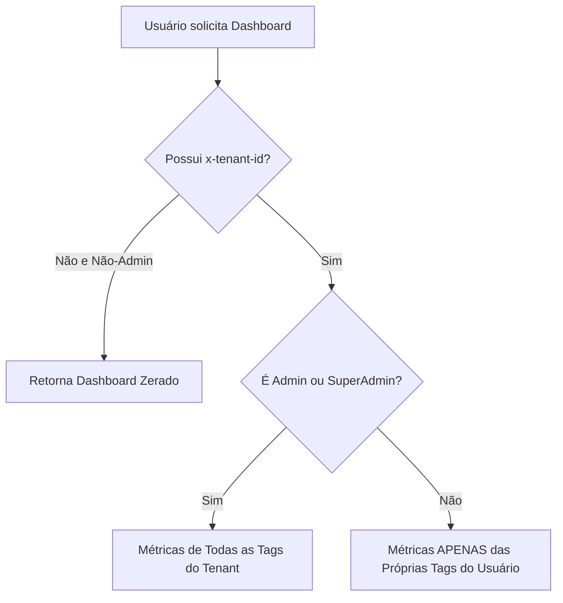

# 🔐 Regras de Permissão e Políticas ABAC - Feature Dashboard

Este documento detalha o controle de acesso por papéis e atributos (**RBAC** / **ABAC**) e o isolamento de dados multi-tenant aplicados ao carregar e renderizar as métricas do painel de **Dashboard** no **SmartContact**.

---

## 🏗️ 1. Isolamento Multi-Tenant

As estatísticas de cliques e leads coletados são isoladas no nível do Tenant:
* O cabeçalho `x-tenant-id` chaveia o Workspace ativo.
* Se um usuário mudar de Workspace no frontend usando o Context Switcher, o `activeTenantId` atualiza reativamente e o `DashboardContainerComponent` recarrega as métricas disparando `loadSummary()`.
* **Regra de Segurança do Backend:** Se a requisição vier sem o cabeçalho `x-tenant-id` e o usuário logado não for um `SuperAdmin` global, o backend retorna um painel zerado (`emptySummary()`) para mitigar vazamentos de dados entre contas de tenants diferentes.

---

## 🔒 2. Regras de Visibilidade (ABAC / RBAC)

A visibilidade das métricas dentro do painel do Dashboard varia dinamicamente no backend (`AnalyticsService.getSummary()`) de acordo com o nível hierárquico do usuário:



### 👨‍💼 Administradores (Papéis: `administrador` ou `SuperAdmin` global)
* **Escopo:** Visualiza dados agregados de **toda a empresa** no inquilino ativo.
* **Dados Exibidos:** Cliques totais, leads agregados e distribuições geradas por todos os membros, tags e dispositivos associados ao Workspace.

### 👥 Colaboradores / Membros Comuns (Papéis: `colaborador`, `usuario` standard, etc.)
* **Escopo:** Escopo de autopropriedade restrito.
* **Dados Exibidos:** A consulta SQL no banco filtra os registros de interações limitando-se estritamente às tags associadas ao próprio usuário logado:
  ```sql
  WHERE (tag.owner_id = :userId OR tag.user_id = :userId)
  ```
* **Privacidade:** Um colaborador nunca visualizará dados de cliques, origens ou leads coletados por tags de outro colega da equipe.

---

## ⚙️ 3. Lógica de Gerência de Estado Reativo (Signals)

No frontend, a feature utiliza a arquitetura reativa nativa do Angular (Signals) para gerenciar o estado da requisição e evitar renderizações desnecessárias:

1. **Privacidade do Estado:**
   * O `DashboardService` armazena o estado como um `WritableSignal` privado (`#state`) para evitar que componentes alterem o estado de carregamento de forma inadequada.
   * Expõe o estado publicamente como um sinal somente leitura:
     ```typescript
     readonly state = this.#state.asReadonly();
     ```
2. **Derivação de Estado (Computed):**
   * O componente [dashboard-container.ts](file:///home/jaspion/projetos/smartcontact/frontend/src/app/features/dashboard/pages/dashboard-container/dashboard-container.ts) utiliza sinais computados (`computed()`) para derivar e expor de forma limpa `summary`, `isLoading` e `error` para o template HTML.
