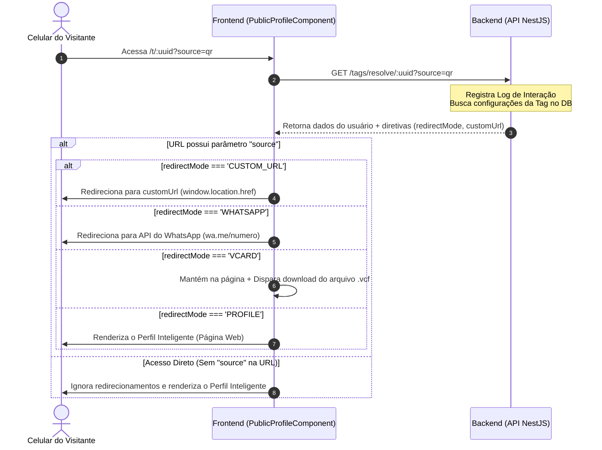

# 🚀 Fluxo de Geração e Redirecionamento Dinâmico de QR Code / NFC

Este documento detalha a arquitetura técnica, a lógica de geração de QR Codes e o mecanismo de identificação e redirecionamento dinâmico baseado nas opções do usuário no sistema **SmartContact**.

---

## 🏗️ 1. Geração do QR Code na Página de Perfil

No componente [profile-page.ts](file:///home/jaspion/projetos/smartcontact/frontend/src/app/features/users/pages/profile-page/profile-page.ts), o QR Code pessoal do usuário é gerado dinamicamente no método `generatePersonalQR()`.

### Mecanismo de Geração
1. **Composição do Link Alvo:**
   O sistema cria uma URL pública contendo o identificador do recurso e uma flag de controle de origem (`source`):
   $$\text{URL} = \text{window.location.origin} + \text{"/t/"} + \text{identifier} + \text{"?source=qr"}$$
   * **`identifier`:** Resolvido prioritariamente na ordem: `tag.handle` (se configurado) ➔ `authService.userUsername()` ➔ `tag.uuid`.
   * **`?source=qr`:** Parâmetro de consulta fundamental para que o sistema saiba, no momento da leitura, que a navegação se deu através de um escaneamento físico da câmera do celular.

2. **Renderização Visual:**
   A biblioteca `qrcode` é utilizada para converter a string da URL em uma matriz de módulos QR e desenhá-la em um elemento HTML `<canvas>` referenciado por `#qrcodeCanvas`:
   ```typescript
   QRCode.toCanvas(this.qrcodeCanvas.nativeElement, url, {
       width: 250,
       margin: 1,
       color: { dark: '#000000', light: '#ffffff' }
   });
   ```

---

## 🧭 2. Fluxo de Leitura, Identificação e Redirecionamento

Quando um dispositivo móvel escaneia o QR Code (ou aproxima o chip NFC configurado com `?source=nfc`), o fluxo de navegação e resolução do destino é disparado:



### Detalhamento das Etapas

### A. Captura de Parâmetros (Frontend Público)
O roteador direciona a URL pública para o [PublicProfileComponent](file:///home/jaspion/projetos/smartcontact/frontend/src/app/features/users/pages/public-profile/public-profile.component.ts). No gancho `ngOnInit()`, os parâmetros de rota e consulta são capturados:
```typescript
const uuid = this.route.snapshot.paramMap.get('uuid');     // Identificador do recurso
const source = this.route.snapshot.queryParamMap.get('source'); // Origem (ex: 'qr' ou 'nfc')
```

### B. Resolução de Regras de Negócio (Backend)
O frontend invoca o serviço `tagService.resolveTag(uuid, source)` que dispara uma requisição à API. O backend é responsável por:
1. Validar se a tag correspondente está ativa e pertence a um tenant válido.
2. Identificar qual canal foi acionado a partir do parâmetro `source` recebido (se for `qr`, avalia as propriedades do QR Code; se for `nfc`, avalia as propriedades do NFC).
3. Registrar a interação no banco de dados para fins de análise e métricas (InteractionLogs).
4. Responder com os dados públicos do usuário e as configurações específicas daquele canal de redirecionamento:
   * **`redirectMode`:** Modo de destino configurado no dropdown (`PROFILE`, `WHATSAPP`, `VCARD` ou `CUSTOM_URL`).
   * **`customUrl`:** Endereço externo (caso o modo seja `CUSTOM_URL`).

### C. Tomada de Decisão (Frontend)
Com as diretivas resolvidas retornadas pelo backend, o componente público aplica as regras no método `handleRedirection(data)`:

* **Validação Crítica do Acesso:**
  Se a URL acessada **não** possuir a variável de consulta `source` (por exemplo, acesso digitado direto como `/t/joao-silva`), o sistema **aborta qualquer redirecionamento automático**. O visitante é direcionado obrigatoriamente a visualizar a página do Perfil Inteligente, preservando o acesso ao cartão de visitas digital do usuário na web.

* **Execução dos Modos de Redirecionamento (Acesso via QR/NFC):**
  Se a flag `source` estiver presente, o sistema redireciona o navegador conforme a configuração da tag:
  
  1. **Link Customizado (`CUSTOM_URL`):**
     Redireciona diretamente para a URL externa configurada, garantindo que o protocolo `http/https` esteja presente:
     ```typescript
     const targetUrl = data.customUrl.startsWith('http') ? data.customUrl : `https://${data.customUrl}`;
     window.location.href = targetUrl;
     ```
  
  2. **WhatsApp Direto (`WHATSAPP`):**
     Recupera o telefone principal do usuário marcado como canal de WhatsApp, higieniza a string mantendo apenas caracteres numéricos e encaminha o visitante para a API do WhatsApp Link:
     ```typescript
     const mainPhone = data.user.phones?.find((p: any) => p.isWhatsapp) || data.user.phones?.[0];
     if (mainPhone && mainPhone.number) {
       const cleanNumber = mainPhone.number.replace(/\D/g, '');
       window.location.href = `https://wa.me/${cleanNumber}`;
     }
     ```
  
  3. **Salvar Contato (`VCARD`):**
     O visitante permanece na página de Perfil Inteligente do usuário, e o frontend monta e força o download imediato do arquivo no formato de cartão virtual de contatos `.vcf` (padrão vCard 3.0), contendo telefones, e-mails, redes sociais, cargo, empresa e links cadastrados no perfil.
  
  4. **Perfil Inteligente (`PROFILE`):**
     Nenhuma ação de desvio é tomada. O componente público renderiza a árvore de componentes visuais do cartão de visitas web do usuário logado na tela.
